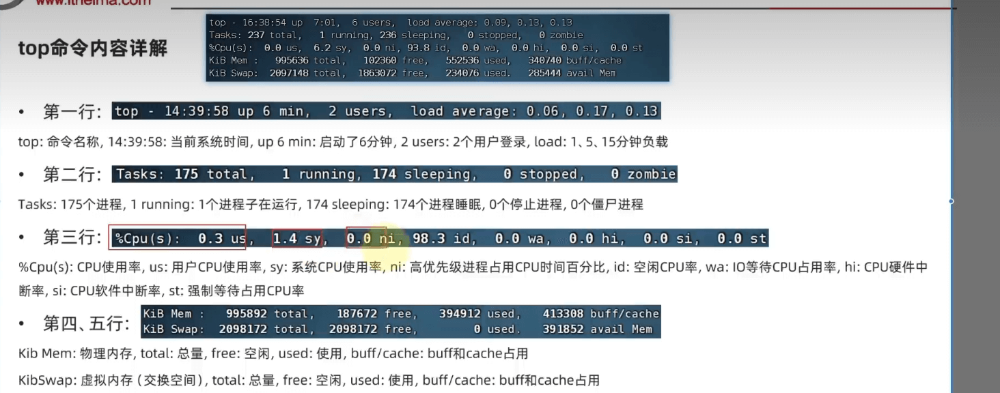
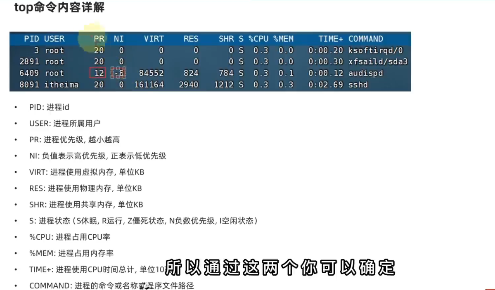

# Linux <Badge type="tip" text="Linux" />

> 只有一个根目录`/`,所有文件都在它下面

## linux 的路径描述方式

linux：`:/` /etc/

wubdiws：`:\` #D:\data\

# linux 命令入门

## 命令基础

> ···

`command [-options] [parameter]`

command:命令本身

options:命令的一些选项，可以通过选项控制行为细节

parameter：命令的参数

[]，表示可选的意思

例：

```
ls -l /home/itheima
cp -r test1 test2 cp是命令本身，-r是选项，test和test2是参数，意思是复制文件夹test1成为test2

```

## 命令入门

ls：列出目录下的内容

`ls [-a -l -h] [linux 路径]`

- -a 选项，表示：all 的意思，全部的文件列出来
- -l 以列表形式排列展示内容
- -h 表示以易于阅读，格式化文件大小。必须跟 l 搭配使用

语法种的选项是可以组合使用的

- ls -l -a
- ls -la
- ls -al

## Home 目录和工作目录

home 目录：每个 linux 操作用户在 linux 系统的个人账户目录。路径在：/home/用户名

- 如，当前用户是 itheima。其 home 目录是：/home/itheima
- windows 和 linux 系统，均设有用户的 home 目录

## 目录切换相关命令（cd/pwd）

### cd 切换工作目录

:::tip 提示
cd：change directory
:::

语法：`cd [linux路径]` 不写参数默认去 home 目录

~ 是 home 目录的意思。

1. 如果以超级用户 root 账号登陆：~ 是 /root 目录
2. 如果以普通用户 name 登陆：~是 /home/name 目录

### pwd 查看当前工作目录

:::tip 提示
pwd：print work directory

:::

语法：`pwd`

pwd 命令，无选项，无参数，直接输入

## 相对路径，绝对路径和特殊路径符

绝对路径：以根目录为起点，以`/`开头`cd /home/iteheima/Desktop`

相对路径：以当前目录为起点，无需以`/`开头`cd Desktop`

特殊路径符：

- `.`表示当前目录，比如`cd ./desktop` 表示切换到当前目录下的`desktop`目录内和`cd desktop`效果一样
- `..`表示上一级目录，比如：`cd ..` 切换到上一级，`cd ../..` 切换上一级的上一级目录
- `~ `表示 home 目录，比如：`cd ~`切换到 home 目录或者`cd ~/desktop`, 切换到 home 内的 desktop 目录

## 创建目录（mkdir）

:::tip 提示
mkdir：make directory
:::

语法：mkdir [-p] linux 路径

- 参数必填，需要创建的文件夹路径。
- -p 选项可选，表示自动创建不存在的父目录，适用于多层级的目录

```shell
mkdir -p ~/itcast/itheima/nice/666
```

## 文件操作

### touch，cat，more

语法：touch linux 路径\*

- touch 命令无选项，参数必填。

用于创建文件

```shell
touch test.txt #在当前目录下创建名为test的文件
```

- cat 命令 查看文件内容 语法：cat linux 路径

```shell
cat test.txt
```

- more 命令跟 cat 差不多，只不过 more 支持翻页。内容过多的，可以一页页的展示，空格翻页，q 退出查看

```shell
more test.txt
```

### cp，mv，rm

cp 用于复制

语法：`cp  [-r] 参数1 参数2`

- -r 选项，用于复制文件夹使用，表示递归
- 参数 1，表示复制的文件或文件夹
- 参数 2，复制去的地方

mv 用于移动

语法：`mv 参数1 参数2`

- 参数 1，表示移动的文件或文件夹
- 参数 2，表示要移动去的地方，如果目标不存在，则进行改名，确保目标存在。（有改名的效果）

rm 用于删除

语法：`rm [-r -f]参数1，参数2.....参数N`

- 同 cp 命令一样，-r 表示 recursion 选项用于删除文件夹，递归
- -f 表示 force。强制性的（不会弹出提示确认信息）
  - 普通用户删除内容不会弹出提示，只有 root 管理员用户删除内容会有提示
  - 所以一般普通用户用不到`-f`的选项
- 参数 1，参数 2.....参数 n，表示要删除的文件或文件夹路径，按照空格隔开。

rm 命令支持通配符\*，用来做模糊匹配

- 符号\*表示通配符。即匹配任意内容（包含空），
- test\*，表示匹配任何 test 开头的内容，
- \*test，表示匹配任何以 test 结尾的内容，
- \*test\*，表示匹配任何包含 test 的内容

```shell
rm -r test*
ls
```

可以通过 `su - root`，输入密码切换为 root 用户。

通过 exit 命令，退回普通用户

## 查找命令

which，find

which 命令可以查看 命令的程序文件所在位置，命令本体是二进制可执行程序，例：`which cd`

find 命令去可以搜索指定的文件，支持使用通配符

语法：`find 起始路径 -name '搜索的文件名'`

按照文件大小查找：

语法：`find 起始路径 -size +|- n[kMG]`

- +,-表示大于和小于
- n 代表大小数字
- kmg 表示单位，k（小写）表示 kb，M 表示 mb，G 表示 gb

```shell
find / -size -10m #查找小于10mb的文件
```

## grep,wc 和管道符 {#grep}

grep 命令，从文件中通过关键字查询文件行
语法：`grep [-n] '搜索的内容' 文件路径`

- -n 选项，表示显示行号
- 搜索的内容，表示要搜索的内容
- 文件路径，表示要搜索的文件路径

```shell
grep -n 'hello' test.txt
```

wc 命令，用于统计文件的内容（统计文件的行数，单词数，字符数，字节数）
语法：`wc [-c -m -l -w] 文件路径`

- -c 选项，表示 bytes 数
- -m 选项，表示统计字符数
- -l 选项，表示统计行数
- -w 选项，表示统计单词数

```shell
wc -l test.txt
```

管道符：`|`

管道符，表示将前一个命令的结果，作为后一个命令的输入

```shell
ls -l | grep 'hello'
```

## echo,tail 和重定向符

### echo

> 输出字符串到终端

语法：`echo [-e] 字符串`

- -e 选项，表示支持转义字符

```shell
echo 'hello world'
```

反引号`

例如：`echo pwd`
本意是想输出当前的工作路径，pwd 被当作字符串了。

```shell{2}
echo pwd
pwd
```

```shell{2}
echo `pwd`
/home/itheima
```

### tail

> 查看文件末尾的内容，跟踪文件的最新更改

语法：`tail [-f -num] 文件路径`

- -num 选项，表示显示的行数
- -f 选项，表示持续跟踪(类似于一直监听)

```shell
tail -n 5 test.txt
tail -5 test.txt
```

### 重定向符

> 重定向命令的输出到文件或其他命令

- `>` 将左侧的命令的结果，**覆盖**写入到符号右侧指定的文件中（文件如果不存在，则会自动创建）
- `>>` 将左侧的命令的结果，**追加**写入到符号右侧指定的文件中
- `<` 重定向符，表示输入文件内容

```shell
# 输出到文件
ls -l > file.txt
echo 'hello world' > test.txt

# 追加到文件
ls -l >> file.txt

# 输入文件内容
cat < file.txt

```

## vi\vim

> 编辑器，命令行下使用的文本编辑器

命令模式：命令模式下，所敲的按键编辑器都理解为命令，以命令驱动执行不同功能，此模型下不能自由进行文本编辑

输入模式：输入模式下，可以自由进行文本编辑，按下键盘上的字母键，编辑器会将其解释为对应的字符，并在屏幕上显示出来

底线模式：底线模式下，可以执行一些命令，如保存文件、退出编辑器等。在底线模式下，按下`:`，进入命令模式，可以输入命令

语法：`vi/vim 文件路径`

```shell
# 如果文件不存在，则创建文件，存在则打开文件
vi/vim test.txt
```

1. 进入编辑模式：按下`i`键，进入输入模式
2. 退出编辑模式：按下`esc`键，退出输入模式
3. 保存文件：按下`:`，进入底行模式，输入`wq`命令，保存并退出编辑器

`yy` 复制当前行

`dd` 删除当前行

`ndd` 删除当前行之后的 n 行 #3dd 删除三行

`gg` 移动到文件开头

`G` 移动到文件末尾

`dG` 从当前行开始，向下全部删除

`dgg` 从文件开头，向上全部删除

`d$` 从当前位置删除到行尾

`d0` 从当前位置删除到行首

`x` 删除光标所在的字符

`0` 移动到行首

`p` 粘贴

`u` 撤销

`/` 搜索

`n` 向下搜索

`N` 向上搜索

底线模式命令：

1. `:q` 退出编辑器
2. `:wq` 保存并退出编辑器
3. `:w` 保存文件
4. `:set nu` 显示行号
5. `:set nonu` 取消显示行号
6. `:set nu!` 强制显示行号
7. `:set paste` 进入粘贴模式，可以粘贴多行文本
8. `:set nopaste` 退出粘贴模式
9. `:! 命令` 执行系统命令

## linux 的 root 用户

> 超级用户，拥有最高权限，可以做任何操作，包括修改系统文件

语法：`su [-] [用户名]`

1. 切换到 root 用户：`su - root`
2. 退出 root 用户：`exit` 快捷键是`Ctrl+D`
3. 用户名省略，默认切换到 root
4. 使用普通用户，切换到其他用户需要输入密码
5. 使用 root 用户切换到其他用户，不需要输入密码

### sudo 命令

:::tip 提示
不建议长期使用 root 用户，可以使用 sudo 命令，为普通的命令授权，临时以 root 身份执行
:::

语法：`sudo 命令`

- 在其他命令之前，带上 sudo，表示以 root 身份执行命令
- 只有 root 用户才能执行 sudo 命令，普通用户无法执行
- 需要为普通用户配置 sudo 认证

1. 配置 sudo 认证：`visudo` 或者 `vi /etc/sudoers`
2. 编辑文件，写入 `用户名 ALL=(ALL)   NOPASSWD: ALL`
3. 保存并退出

## 用户和用户组

用户组管理

需要 `root` 用户才可以执行

- 创建用户组：`groupadd 组名`
- 删除用户组：`groupdel 组名`
- 修改用户组：`groupmod 组名`

用户管理

1. 创建用户：`useradd [-g -d] 用户名`
   - -g 选项，表示指定用户组,不指定，会创建同名组并自动加入，指定`-g`需要组已经存在，否则会报错
   - -d 选项，表示指定用户`home`目录，不指定，HOME 目录默认在：`/home/用户名`
2. 删除用户：`userdel [-r] 用户名`
   - -r 选项，表示删除用户 `home` 目录，默认当删除用户时，不删除 `home` 目录
3. 修改用户：`usermod [-g 组名] [-d 目录] 用户名`
4. 查看用户所属组 `id[用户名]`
5. 修改用户所属组 `usermod -aG 组名 用户名` 指定用户加入指定用户组

gentent <br>
使用 `gentent` 命令，可以查看当前系统有哪些用户
语法：`gentent passwd`

> 用户名：密码(x):用户 ID:组 ID:用户信息:主 Home 目录:shell(执行终端)

语法：`gentent group`

> itcast\:x\:1001: 组名称：组认证（x）:组 ID

## 查看权限控制

认知权限信息

drwxr-xr-x：

- 这是一个文件夹，首字母 d 表示
- 所属用户（图上序号 2）的权限是：有 r 有 w 有 x，rwx
- 所属用户组（图上序号 3）的权限是：有 r 无 w 有 x，r-x （-表示无此权限）
- 其他用户的权限：有 r 无 w 有 x，r-x

- `r` 表示可读，`w` 表示可写，`x` 表示可执行 `d` 表示目录，`-` 表示普通文件，`l` 表示链接文件，`b` 表示块设备文件，`c` 表示字符设备文件，`p` 表示管道文件


## chmod 命令

> 修改文件或目录的权限

:::tip 提示
注意，只有文件，文件夹的所属用户或 root 用户可以修改
:::
语法：`chmod [-R] 权限 文件或文件夹`

- -R 选项，表示递归修改子目录及其子目录下的文件或文件夹的权限

示例：

- `chmod u=rwx,g=rx,o=x hello.txt` 文件权限修改为：`rwxr-x--x`#将文件或文件夹的所属用户(**u**)的权限设置为：读写执行，所属用户组(**g**)的权限设置为：读执行，其他用户(**o**)的权限设置为：执行

权限的数字序号

权限可以用 3 位数字来代表，第一位数字表示用户权限，第二位表示用户组权限，第三位表示其他用户权限

数字的细节如下：`r` 记位 4，`w` 记为 2，`x` 记为 1

- 0 表示没有权限 即 ---
- 1 表示 x 权限 即 --x
- 2 表示 w 权限 即 -w-
- 3 表示 w 和 x 权限 即 -wx
- 4 表示 r 权限 即 r--
- 5 表示 r 和 x 权限 即 r-x
- 6 表示 r 和 w 权限 即 rw-
- 7 表示 r、w 和 x 权限 即 rwx

所以 751：`rwxr-x--x` 123:`--x-w--wx`

## chown 修改文件所属者

> 修改文件或目录的所属用户和用户组 只适用于 root 用户执行

语法：`chown [-R] [用户][:][用户组] 文件或文件夹`

- -R 选项，表示递归修改子目录及其子目录下的文件或文件夹的所属用户和用户组
- 用户和用户组可以用用户名或用户组名，不指定，表示不修改
- `：`用于分割用户和用户组

示例：

- `chown root hello.txt`将 hello 文件所属用户修改为 root
- `chown :root hello.txt`将 hello 文件所属用户组修改为 root
- `chown root:root hello.txt`将 hello 文件所属用户和用户组修改为 root
- `chown -R root test`递归修改 test 文件夹及其子目录下的文件或文件夹的所属用户和用户组为 root

## 各类小技巧快捷键

- 强制停止 `ctrl+c`
- 退出或登出 `ctrl+d || exit`
- 历史命令搜索 `history || !命令前缀 || ctrl+r` 自动执行上一次匹配的命令
- 光标移动 `ctrl+a（跳到命令开头） || ctrl+e（跳到命令结尾） || ctrl+键盘左键（向左跳一个单词） || ctrl+右键 （向右跳一个单词） || ctrl+u（删除光标前面的所有字符） || ctrl+k（删除光标后面的所有字符） || ctrl+w（删除光标前面的一个单词） || ctrl+y（粘贴刚刚删除的字符）`
- 清屏 `ctrl+l || clear`

## 软件安装

> yum:RPM 包软件管理器，用于自动化安装配置 linux 软件，并可以自动解决依赖问题
> 语法：`yum（apt ubuntu） [-y] [install|remove|search] 软件名称`

- 选项：-y 自动回答 yes，不提示
- install 安装软件
- remove 卸载软件
- search 搜索软件

:::tip 提示
yum 命令需要 root 权限，可以 su 切换到 root，或者 sudo 提权
yum 是需要联网的
:::

## systemctl

> linux 系统很多软件都支持 systemctl 命令控制

语法：`systemctl start | stop | status | enable | disable 服务名`

- start 启动
- stop 关闭
- status 查看状态
- enable 开机自启
- disable 关闭开机自启

系统内置的服务比如：

- networkmanager，主网络服务
- network，福网络服务
- firewalld，防火墙服务
- sshd,ssh 服务

## 软连接

> 在系统中创建软连接，可以将文件，文件夹链接到其它位置（类似 win 的快捷方式）

语法： `ln -s 参数1 参数2`

- -s 选项，创建软连接
- 参数 1：被链接的文件或文件夹
- 参数 2：要链接去的目的地

## 日期和时区

date 命令可以在命令行中查看系统时间

语法：`date [-d] [+格式化字符串]`

- -d 选项，指定时间
- - 选项，指定格式化字符串
- 格式化字符串：`%Y-%m-%d %H:%M:%S:%s`

```shell
date "+%Y-%m-%d %H:%M:%S"
```

示例：`date -d "+1 day"` (日期加减支持的时间标记为：year 年，month 月，day 天，hour 小时，minute 分钟，second 秒)

修改 linux 时区

使用 root 权限，执行以下命令，修改时区为东八区

```shell
rm -f /etc/localtime
sudo ln -s /usr/share/zoneinfo/Asia/Shanghai /etc/localtime
```

ntp 程序

> 我们可以通过 ntp 自动校准时间

安装 `ntp：yum（apt） -y install ntp`

启动并设置开机自启

- systemctl start ntpd
- systemctl enable ntpd

手动校准：`ntpdate -u ntp.aliyun.com`

## ip 地址，主机名

ip 命令可以在命令行中查看系统 ip 地址

可以通过命令：`ifconfig`,安装`net tools`，然后执行 `ifconfig` 命令

### 特殊 ip 地址

- 127.0.0.1，指代本机
- 0.0.0.0，特殊 ip 地址
  - 可以用于指代本机
  - 可以在端口绑定中用来确定绑定关系
  - 在一些 ip 限制中，表所有 ip 的意思，如放行规则设置为 0.0.0.0,表示允许任意 ip 访问

### 主机名

- `hostname查看主机名`
- `hostnamectl set-hostname 主机名` 设置主机名

### 域名解析


### 固定 ip

> DHCP：动态获取 ip 地址，每次重启设备都会获取一次

[VWware 虚拟机配置固定 ip](https://blog.csdn.net/m0_60607927/article/details/137416986)

## 网络请求和下载

### ping 命令

> ping 命令可以在命令行中查看网络状态

语法：`ping [-c num] ip或者主机名`

- -c 选项，指定发送次数
- 参数：ip 或主机名

### wget 命令

> wget 命令可以在命令行中下载文件

语法：`wget [-b] url`

- -b,后台下载，会将日志下入当前工作目录的 wget-log 文件（`tail -f wget-log` 查看下载进度）
- 参数：url 下载地址

### curl 命令

> curl 发送 http 网络请求 命令可以在命令行中下载文件，获取信息

语法：`curl [-O] url`

- -O 选项，用于下载使用

- 参数：url 下载地址

示例：`curl -O https://cdn.itheima.net/README.md`

示例：`curl cip.cc`

## 网络传输

查看端口占用

- 使用 nmap 命令，安装`yum -y install nmap`

语法：`nmap 被查看的ip地址`

- 也可以使用 netstat 命令，查看指定端口的占用情况

语法：`netstat -anp | grep 端口号`,安装`yum -y install net-tools`

## 进程管理

可以通过 ps 命令查看 linux 系统中的进程信息

语法：`ps [-e -f]`

- e,显示全部的进程
- f,以完全格式化的形式展示信息
  一般来说，固定用法：`ps -ef` 列出全部进程的全部信息

- UID：进程所属的用户 id
- PID：进程 id
- PPID：父进程 id
- C：进程使用的 cpu（占用率%）
- STIME：进程的启动时间
- TTY: 启动此进程的终端序号，如显示？，表示非终端启动
- STAT：进程状态
- TIME: 进程使用的时间
- CMD：进程的命令（执行的程序名称）

### 查看指定进程

- 在 finalshell 中，执行命令：tail，可以查看指定进程的日志

```shell
ps -ef | grep tail
```

### 关闭进程

语法：`kill [-9] 进程id`

- -9 选项，强制关闭进程

## 主机状态

### 查看系统资源占用

- 可以通过`top`命令查看 cpu，内存使用情况





top 命令选项：

- -p 只显示某个进程的信息
- -d 设置刷新时间，默认 5s
- -c 显示产生进程的完整命令
- -n 指定刷新次数，比如`top -n 3`刷新 3 次
- -b 以非交互式全屏模式运行,以批次的方式执行 top，一般配合-n 指定输出几次统计信息，将输出重定向到指定文件，比如`top -b -n 3 > /temp/top.tmp`
- -i 不显示任何闲置(idle)或无用(zombie)的进程
- -u 查找特定用户启动的进程，比如`top -u root`查找 root 用户启动的进程

### 磁盘信息监控

- 使用 df 命令，可以查看硬盘的使用情况
- iostat 命令可以查看 cpu,磁盘的使用情况

语法：`df [-h]`

- -h 选项，以带单位的方式显示

语法：`iostat [-x] [num1] [num2]`

- -x,显示更多信息
- num1：数字，刷新间隔，num2：数字，刷新几次

### 网络状态监控

语法：`sqr -n DEV num1 num2`

- -n 选项，指定网卡
- num1：数字，刷新间隔
- num2：数字，刷新几次

## 环境变量

linux 系统中执行：`env`命令即可查看

```shell
echo $PATH
```

### 自行设置环境变量

- 临时设置，`export 变量名=变量值`
- 永久设置
  - 针对当前用户生效，配置在当前用户的：`~/.bashrc文件中`
  - 针对所有用户生效，配置在系统的：`/etc/profile文件中`
  - 并通过语法：`source .bashrc`配置文件，进行立刻生效，或重新登录 finalshell 生效

### 自定义环境变量 PATH

- 临时设置 `export PATH=$PATH:/自己目录`
- 永久设置，针对当前用户生效
- 针对所有用户生效，配置在系统的：`/etc/profile文件中`
- 并通过语法：`source .bashrc`配置文件，进行立刻生效，或重新登录 finalshell 生效

## 上传，下载

rz,sz 命令可以上传和下载文件 通过`yum -y install lrzsz`安装

- rz 命令，进行上传，语法：直接输入 `rz` 即可
- sz 命令 ，进行下载，语法：直接输入 `sz 文件名` 即可
